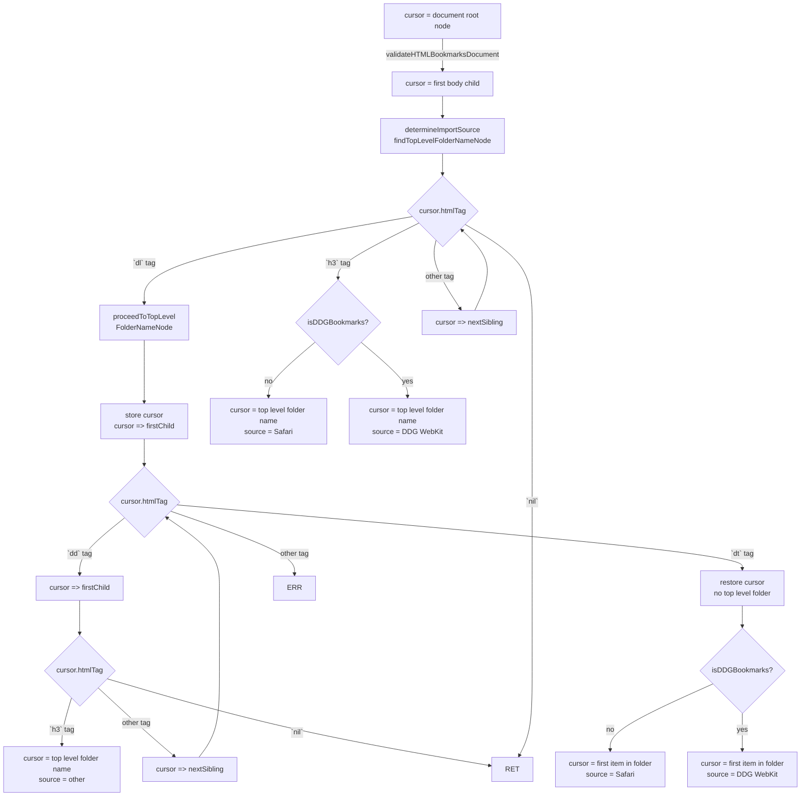
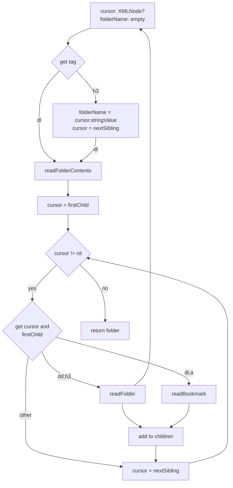
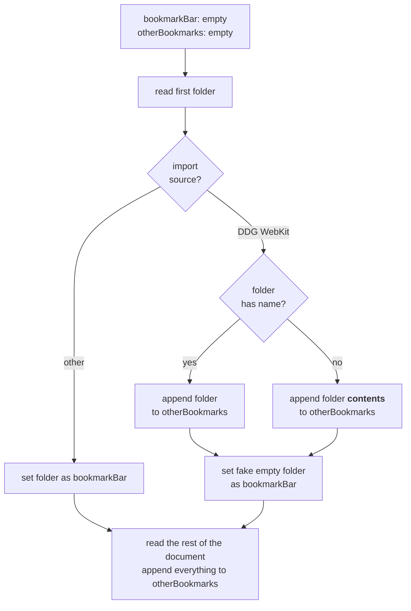

# Bookmarks HTML Reader flows

## Determining import source

```mermaid
graph TD
    A[cursor = document root node] -->|validateHTMLBookmarksDocument| B[cursor = first body child]
    B --> C[determineImportSource<br>findTopLevelFolderNameNode]
    C --> D{cursor.htmlTag}
    D -->|`dl` tag| E[proceedToTopLevel<br>FolderNameNode]
    E --> E1[store cursor<br>cursor => firstChild]
    E1 --> F{cursor.htmlTag}
    F -->|`dd` tag| F1[cursor => firstChild]
    F1 --> G{cursor.htmlTag}
    G -->|`h3` tag| H[cursor = top level folder name<br>source = other]
    G -->|other tag| G1[cursor => nextSibling]
    G -->|`nil`| RET
    G1 --> F
    F -->|`dt` tag| I[restore cursor<br>no top level folder]
    F -->|other tag| ERR
    D -->|`h3` tag| J{isDDGBookmarks?}
    D -->|other tag| NXT[cursor => nextSibling]
    NXT --> D
    D -->|`nil`| RET
    I --> K{isDDGBookmarks?}
    K -->|no| L[cursor = first item in folder<br>source = Safari]
    K -->|yes| M[cursor = first item in folder<br>source = DDG WebKit]
    J -->|no| N[cursor = top level folder name<br>source = Safari]
    J -->|yes| O[cursor = top level folder name<br>source = DDG WebKit]
    
```

## Reading a folder

```mermaid
graph TD
    A[cursor: XMLNode?<br>folderName: empty] --> B{get tag}
    B -->|h3| C[folderName = cursor.stringValue<br>cursor = nextSibling]
    B -->|dl| D
    C -->|dl| D[readFolderContents]
    D --> E[cursor = firstChild]
    E --> F{cursor != nil}
    F -->|yes| G{get cursor and<br>firstChild}
    G -->|dd,h3| H[readFolder]
    G -->|dt,a| I[readBookmark]
    H --> J
    I --> J[add to children]
    G -->|other| K[cursor = nextSibling]
    H --> A
    J --> K
    F -->|no| L[return folder]
    K --> F
```

## Constructing ImportedBookmarks object

```mermaid
graph TD
    A[bookmarkBar: empty<br>otherBookmarks: empty] --> B[read first folder]
    B --> C{import<br>source?}
    C -->|DDG WebKit| D{folder<br>has name?}
    D -->|yes| E[append folder<br>to otherBookmarks]
    D -->|no| F[append folder <b>contents</b><br>to otherBookmarks]
    C -->|other| G[set folder as bookmarkBar]
    E --> H[set fake empty folder<br>as bookmarkBar]
    F --> H
    G --> I[read the rest of the document<br>append everything to otherBookmarks]
    H --> I
```
