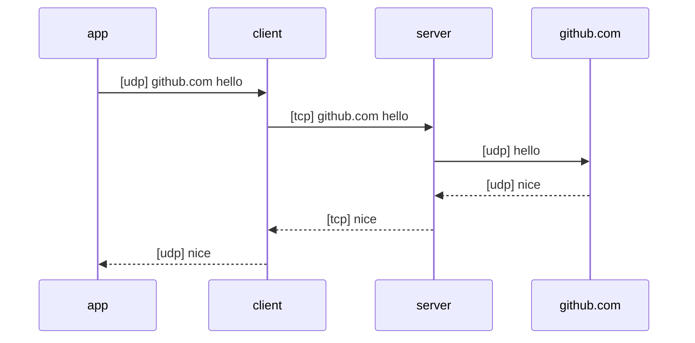

# UDP-Over-TCP

UDP-Over-TCP is a proxy library written in Go. It works on transport layer, which transfers payload of UDP packet over TCP. It does not involving IP or TCP/UDP packet headers.

For example: app sends `hello` to github.com over UDP and github.com replies `nice`. When using UDP-Over-TCP, the communication is as follow:




### Installation

```shell
go get -u github.com/justlovediaodiao/udp-over-tcp
```

Import in your code:

```go
import "github.com/justlovediaodiao/udp-over-tcp"
```

### Quick start

- client

```go
import "github.com/justlovediaodiao/udp-over-tcp"

func main() {
    // example code, ignore err check.
    conn, err := net.ListenPacket("udp", ":8080")
    client := uot.Client{
		Dialer: func(addr string) (uot.Conn, error) {
			conn, err := net.Dial("tcp", addr)
			if err != nil {
				return nil, err
			}
			return uot.DefaultOutConn(conn), nil
		},
    }
    client.Serve(uot.DefaultPacketConn(conn), "127.0.0.1:8088")
}
```

Above code listen udp packet on `:8080` and forward to `127.0.0.1:8088` over tcp.

- server

```go
import "github.com/justlovediaodiao/tcp-over-udp"

func main() {
    l, err := net.Listen("tcp", ":8088")
    var server uot.Server
    for {
		conn, err := l.Accept()
		go server.Serve(uot.DefaultInConn(conn))
	}
}
```

Above code listen tcp on `:8088` and forward to target address over udp.


### Usage

Implement `PacketConn` and `Conn` interface to define protocol.

`PacketConn` is udp packet connection. It's used by client, read udp packet, resolve target address and raw packet data.

`Conn` is tcp connection.
- In client side, send target address to server, then pack packets and forward to server. Read and unpack response packets from server.
- In server side, read target address from client, then unpack packets and forward to target address. Pack and write response packets to client.


### Default Protocol

The library provides a default implement.

Protocol define of defaultPacketConn:

socks udp packet format, see RFC 1928 section 7.

Protocol define of defaultConn:

Request:
```
[handshake][packet...]
```
- handshake: target address of packet, which is a socks address defined in RFC 1928 section 4.
- packet: 
```
[size][payload]
```
- size: 2-byte, length of payload.
- payload: raw udp packet.

Response:
```
[packet...]
```

same as Request, but with no handsahke.
